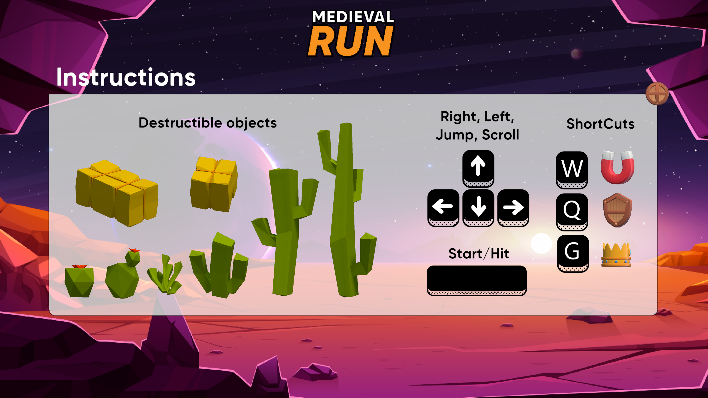

# Temple Run Tribute
  
*A reimagination of the classic Temple Run experience*

## 📜 Introduction
Temple Run is a popular endless runner mobile game where players control an adventurer escaping from demonic creatures while avoiding obstacles, collecting coins, and using power-ups to survive as long as possible. The game became a massive success due to its fast-paced action and simple yet addictive gameplay.

In this project, we have recreated the essence of Temple Run with a fresh design, a unique graphical style, and improved procedural generation. Our goal was to provide an exciting endless runner experience while implementing several key mechanics.

## 🎮 Features & Gameplay
### ✅ Key Features
- **Procedural world generation** 🏞️ (ensuring an unpredictable and dynamic experience)
- **Endless running mechanics** 🏃‍♂️
- **Enemies chasing the player** 👹
- **Three different power-ups** ⚡
- **Destructible and non-destructible obstacles** 🏚️
- **Jump-over obstacles and roll-under obstacles** ⚠️

### 🕹️ Controls

  

| Action | Key |
|--------|-----|
| Move Left | `←` |
| Move Right | `→` |
| Jump | `↑` |
| Roll | `↓` |
| Use Magnetic Power-up | `W` |
| Use Shield Power-up | `Q` |
| GodMode | `G` |

## 🛠️ Development & Technical Details
This game was developed in **Unity** and designed to replicate the classic Temple Run mechanics with our own artistic direction. The procedural generation ensures each run is unique and challenging.

**Tested Platforms:**  
✅ Windows  
❌ macOS & Linux (Not tested, may require additional setup)

**To play:**  
1. Download the binary files from the `/bin/` folder.
2. Run the executable for your system.
3. Enjoy the game!

## 📺 Demo
Watch a **1-minute gameplay demo**:  
  
(*Click the image to play the video*)

## 👥 Credits
This project was created by:
- **Héctor Núñez Carpio**
- **Gissela Borrás Zaplana**

## 📖 Additional Resources
- **Project Report:** [Memory.pdf](./Memory.pdf) 📜
- **License:** [LICENSE.txt](./LICENSE.txt) 📜

---
Enjoy the adventure and challenge yourself to escape as far as possible! 🏃‍♂️🔥

